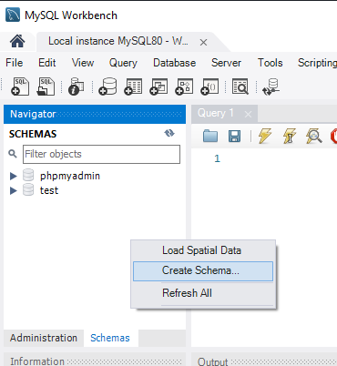
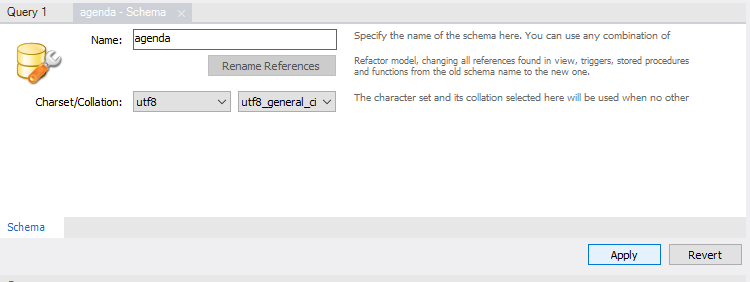
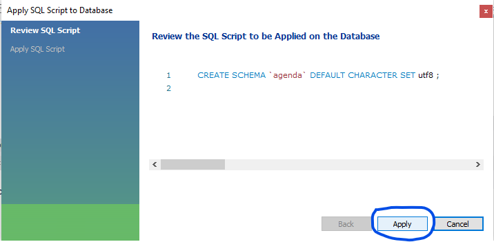
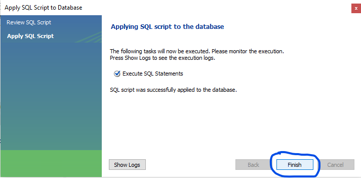

# Java CRUD com MySQL

## Criar Schema no MYSQL workbench.

 - Criar schema.

 - Colacando nome e charset e cliar em apply.

 - Depois que abrir a janela clicar em apply.

 - Esperar e clicar em finish.
